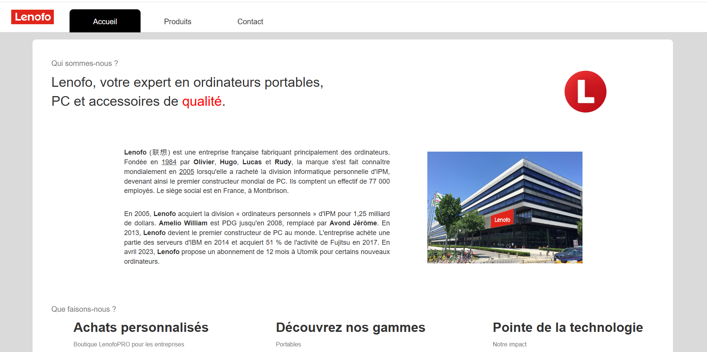

# Site Lenofo

    

---

- [Explication du déroulement du projet](/documentation/EXPLICATION.md)
- [Installation de Rocky Linux](/documentation/Rocky/Rocky.md)
- [Documentation d'installation du script](/documentation/utilisateur/documentation.md)

### Commandes d'installation

*/Commande complète du script :*/

`wget -qO- https://raw.githubusercontent.com/Rxdy/Site/refs/heads/main/script.sh | bash`

**Commande raccourcie du script :**

`wget -qO- https://bit.ly/lenofo | bash`

--- 

    

