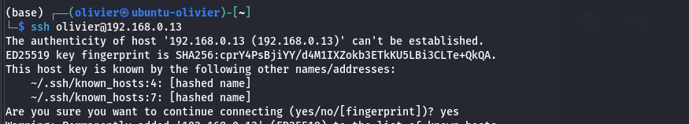
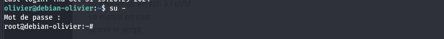
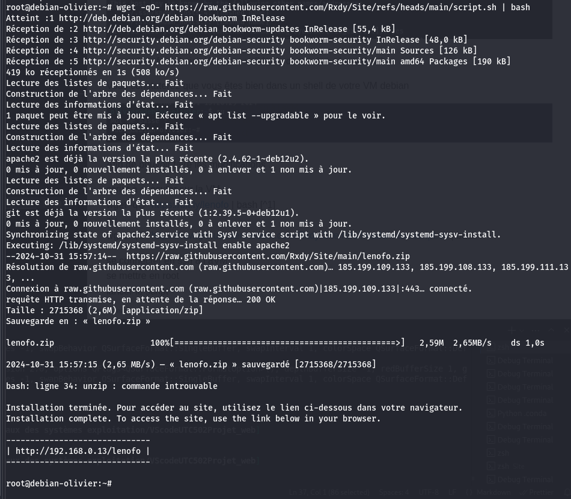

# MISE EN OEUVRE DU DEPLOIEMENT DU SITE SUR LE SERVEUR

# Prérequis
un pc hôte
virtualbox
VM Debian ou VM Rocky (voir doc Installation) 
configuration des VM
configuration réseau en pont
    connaitre l'adresse IP de la VM
avoir les accès à un compte utilisateur sur la VM (nom d'utilisateur et mot de passe)
avoir les droits administrateurs (root): connaitre le mot de passe root de la VM

avoir le site sur le repository de Github
avoir préalablement mis à disposition sur le repository le script.sh

lancer terminal
saisir ssh utilisateur@adresse_IP_VM_debian

si première fois choisir Yes pour valider la connexion sécurisé ssh

Vous constaterez que vous êtes bien dans un shell de votre VM debian

Afin de pouvoir faire les modifications ...
vous devrez avoir les droits administrateur, pour cela basculer dans le compte root
saisisez "su -" [^2] et validez. Il vous faudra entrer le mot de passe root.

script à executer sur la VM

wget -qO- https://bit.ly/lenofo | bash [^1]
ou
wget -qO- https://raw.githubusercontent.com/Rxdy/Site/refs/heads/main/script.sh | bash

Après validation, le script est téléchargé et exécuté dans la foulée comme le montre cet capture d'écran

se rendre sur un navigateur de son hôte etr saisir l'adresse proposé dans la barre d'adresse de votre navitateur.

se connecter en ssh à l aVM
se mettre en root
lancer le script

## Références
[^1] Utilisez un service de raccourcissement comme Bitly pour transformer une URL longue (ex. https://raw.githubusercontent.com/...) en un lien court (ex. https://bit.ly/lenofo). Cela facilite le partage et la lisibilité, et vous pouvez personnaliser le lien pour plus de clarté.

[^2] Nous avons besoin de "su -" et "su" ne suffit pas. Utiliser su - au lieu de su initialise l'environnement complet de l'utilisateur root, chargeant ainsi toutes les variables d'environnement et chemins nécessaires. Cela assure que les commandes exécutées dans le projet fonctionnent comme si elles étaient lancées depuis une session root complète.

<!-- Remarques à revoir avant suppression:
1. Fonctionne aussi bien pour une sitution serveur dont on connait l'adresse IP.
2. Est ce que l'on peut directeur se connecter en root ? 
3. Essayer avec su (serait ce suffisant ?)
4. Est t il possible de se connecter avec la VM configurer en NAT

-->
