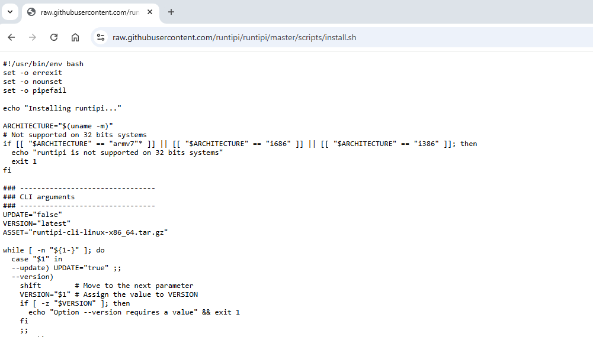
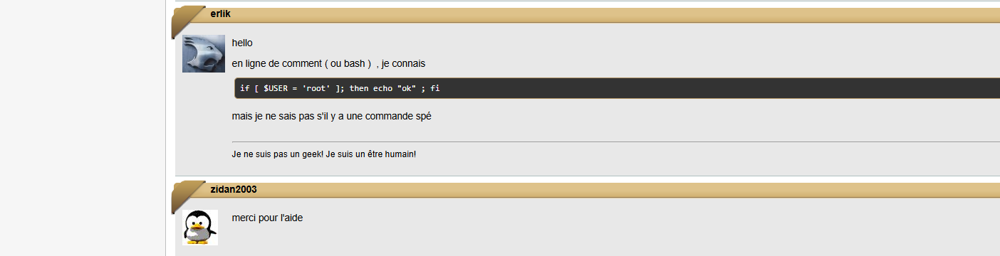
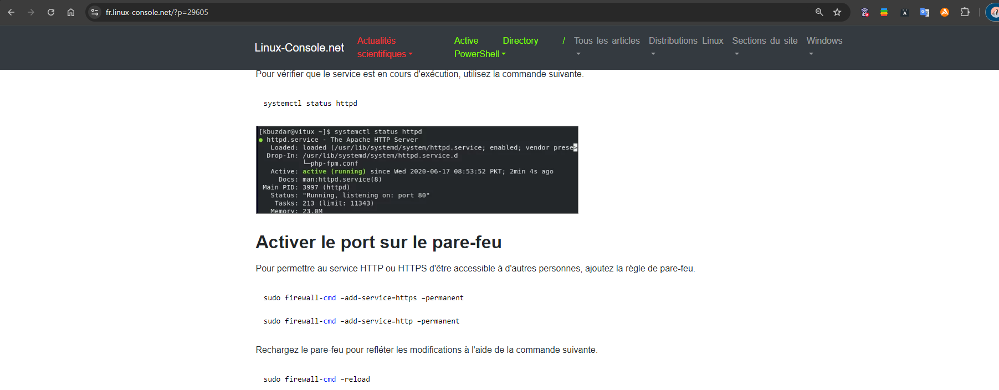
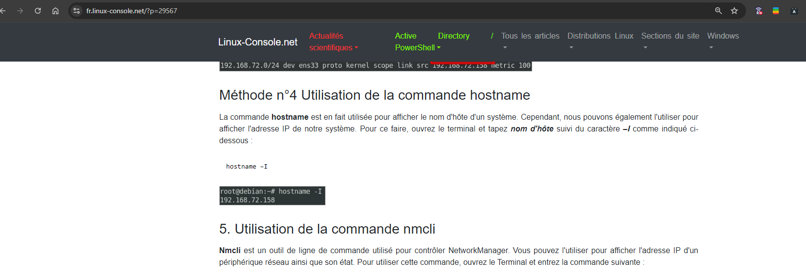
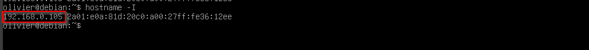
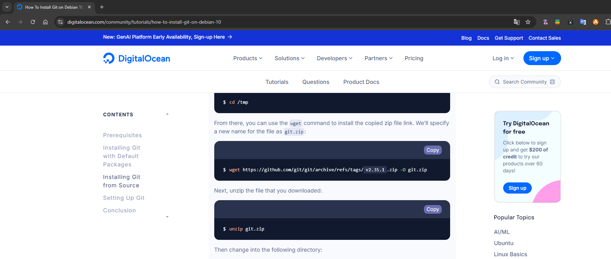

# Document explicatif des démarches et des études tout du long du projet "installation d’un site Web via script"

---

## 1. Introduction

Nous nous sommes rapidement mis en place, ce qui nous a permis d’aborder notre projet avec sérieux. Plutôt que de chercher à aller vite, nous avons pris le temps de concevoir un processus d’installation automatisée de site web, fiable et simple à utiliser. À chaque étape du développement, nous avons réfléchi à comment rendre l’expérience utilisateur la plus fluide possible tout en assurant une installation robuste et en anticipant les défis techniques que nous pourrions rencontrer.

<div style="display: flex; justify-content: center; flex-wrap: wrap; gap: 10px;">
    
    
    
    
</div>

---

## 2. Méthodologie

Nous avons travaillé principalement via des appels sur Discord, parfois en petits groupes de deux à quatre personnes. Le développement principal a été réalisé par un codeur, tandis que les autres membres se concentraient sur des recherches de solutions et des tests. C'est en partie pour cela que le nombre de COMMITS est inégal. 
Nous avons choisi de publier notre code sur un dépôt GitHub public [^2] pour assurer la compatibilité avec `wget`, ce qui aurait pu être problématique avec un dépôt privé.

---

## 3. Déroulement du projet

### 3.1 Inspiration de RunTipi

Nous nous sommes inspirés [^4] d’un script d’installation déjà connu, celui de RunTipi, qui utilise la commande suivante :

`curl -L https://setup.runtipi.io | bash` [^1]

- Lien du script RunTipi : [https://setup.runtipi.io](https://setup.runtipi.io) [^3]



À partir de cette idée, nous avons développé un premier script d’installation avec `wget` (qui est disponible par défaut sur les distributions linux.), permettant le téléchargement direct depuis GitHub. Nous avons effectué nos premiers tests sous Debian, avec un simple fichier `index.html` au départ.

---

### 3.2 Vérification des droits Root

Après avoir effectué plusieurs tests entre nous, nous avons rencontré des problèmes de permissions lorsque le script était exécuté en tant qu’utilisateur standard [^5]. Pour garantir que le script s’exécute avec les droits nécessaires, nous avons ajouté une étape de vérification pour nous assurer que l’utilisateur est bien en mode root sinon un message explicatif est donné.

Pour implémenter cette vérification, nous avons suivi les instructions trouvées sur le forum Ubuntu :
- [https://forum.ubuntu-fr.org/viewtopic.php?id=324110](https://forum.ubuntu-fr.org/viewtopic.php?id=324110)



---

### 3.3 Adaptation pour Debian et Rocky Linux

Lors de l'adaptation de notre script pour qu'il fonctionne à la fois sur Debian et Rocky Linux, nous avons dû prendre en compte les différences entre les gestionnaires de paquets de ces deux distributions.

---

#### Gestionnaires de paquets

- **Debian** utilise le gestionnaire de paquets `APT` (Advanced Package Tool). 
Les commandes avec `APT` sont par exemple: 
`apt update`

- **Rocky Linux**, quant à lui, utilise `DNF` (Dandified YUM).
Les commandes avec `DNF` sont par exemple:
`dnf update`

Ci-dessous tableau présentant différences entre les deux gestionnaires de paquets:

| Caractéristique             | Debian                             | Rocky Linux                     |
|-----------------------------|------------------------------------|---------------------------------|
| **Gestionnaire de paquets** | APT (Advanced Package Tool)       | DNF (Dandified YUM)             |
| **Commande de mise à jour** | `apt update`                      | `dnf update`                    |
| **Installation de paquets** | `apt install <package_name>`      | `dnf install <package_name>`    |
| **Suppression de paquets**  | `apt remove <package_name>`       | `dnf remove <package_name>`     |
| **Nettoyage des paquets**   | `apt autoremove`                  | `dnf autoremove`                |
| **Sources de paquets**      | `/etc/apt/sources.list`           | `/etc/yum.repos.d/`             |
| **Mise à jour complète du système** | `apt upgrade`            | `dnf upgrade`                   |
| **Exemple de distribution** | Debian, Ubuntu                    | Rocky Linux, CentOS, Fedora     |


Nous avons créé une seconde version du script compatible avec Rocky Linux. Les différences notables incluent le fait que Debian utilise `apache2` pour le serveur web, tandis que Rocky Linux utilise `httpd`.

De plus, sous Rocky Linux, il est nécessaire de modifier les règles du pare-feu pour permettre l'accès au port 80 [^6].

Nous avons trouvé les informations nécessaires à ce sujet sur :

- [https://fr.linux-console.net/?p=29605](https://fr.linux-console.net/?p=29605)



---

### 3.4 Détection automatique de la distribution

Pour rassembler les scripts en un seul, nous avons ajouté une détection automatique de la distribution (Debian ou Rocky Linux) grâce à la commande suivante :

`cat /etc/*release*`

- **cat** : Commande qui affiche le contenu d'un fichier dans le terminal.
- **/etc/** : Répertoire où se trouvent les fichiers de configuration du système sous Linux.
- **\*release\*** : Utilisation du caractère joker `*` pour cibler tous les fichiers dans `/etc` dont le nom contient "release" et afficher leur contenu.
  - Les fichiers comme `/etc/os-release` ou `/etc/lsb-release` contiennent des informations sur la distribution Linux (nom, version, etc.).
- **cat /etc/*release*** : Cette commande affiche donc les détails de la distribution et de la version du système d'exploitation en lisant les fichiers pertinents dans `/etc`.


- Source de cette commande : [http://www.tux-planet.fr/connaitre-la-version-de-linux-installe/](http://www.tux-planet.fr/connaitre-la-version-de-linux-installe/)


Le résultat de cette commande retourne :

```
PRETTY_NAME="Debian GNU/Linux 12 (bookworm)"
NAME="Debian GNU/Linux"
VERSION_ID="12"
VERSION="12 (bookworm)"
VERSION_CODENAME=bookworm
ID=debian
HOME_URL="https://www.debian.org/"
SUPPORT_URL="https://www.debian.org/support"
BUG_REPORT_URL="https://bugs.debian.org/"
```

Nous avons seulement besoin du résultat de la 6ème ligne. 

Pour cela nous allons utiliser la commande `grep` qui va retourner un résultat en fonction de ce qu'on lui demande.

Nous allons chercher uniquement la ligne qui contient `ID=`. Pour éviter qu'on nous retourne aussi la 3ème ligne qui contient aussi `ID=` nous allons spécifier que nous ne voulons rien devant avec ceci `^`.

La commande finale est :

 `cat /etc/*release* | grep "^ID="`.

Elle retourne ce résultat sous debian : `ID=debian` et celui-ci sous rocky : `ID="rocky"`

Nous ne pouvons pas plus simplifier le résultat avec la commande `cut` a cause des résultats qui sont de syntaxe différente.

---

### 3.5 Messages d’information utilisateur

Pour rendre le script plus intuitif, nous avons activé un mode verbose [^7] en ajoutant des messages expliquant le succès ou les erreurs d'exécution, ainsi qu'un lien vers l'adresse IP du site web installé.

Nous avons touvé un moyen facile de récupérer l'addresse ip grâce au site : [https://fr.linux-console.net/?p=29567](https://fr.linux-console.net/?p=29567)



Cela facilite le processus, car le résultat est affiché sur une seule ligne, ce qui rend le stockage de la variable dans le script plus simple et permet d'effectuer des opérations de filtrage et de traitement.

Et la commande : `hostname -I` (voir exemple ci-dessous)



---

### 3.6 Autres recherches et Variable

#### 3.6.1 stockage de variables dans un script bash (type .sh)

Nous avons également utilisé des variables pour stocker certains résultats de commandes, en suivant les indications du site :  
- [https://www.it-connect.fr/mettre-le-résultat-dune-commande-dans-une-variable/](https://www.it-connect.fr/mettre-le-resultat-dune-commande-dans-une-variable/)


#### 3.6.2 Recherche sur les commandes et leurs options

Nous avons également effectué de nombreuses recherches sur les commandes et leurs options en utilisant le manuel intégré (man) de Linux, ainsi qu'internet pour approfondir notre compréhension de commandes comme grep, egrep, cut, et bien d'autres.

| Commande | Fonction principale                                       | Syntaxe de base                    | Différences / Particularités                                     |
|----------|-----------------------------------------------------------|------------------------------------|-----------------------------------------------------------------|
| **grep** | Recherche de texte dans un fichier avec des expressions régulières simples | `grep <motif> <fichier>`          | Utilise des expressions régulières basiques (BRE).              |
| **egrep** | Recherche de texte dans un fichier avec des expressions régulières étendues | `egrep <motif> <fichier>`         | Variante de `grep` qui accepte les expressions régulières étendues (ERE), équivalent à `grep -E`. |
| **cut**  | Extraction de colonnes ou de parties spécifiques d'une ligne dans un fichier texte | `cut -d '<délimiteur>' -f <numéro de champ> <fichier>` | Utilisé pour extraire des sections de texte en fonction de délimiteurs, pas de recherche par motifs. |

#### 3.6.3 Stocker une valeur répétitive

En suivant les bonnes pratiques de développement, nous avons privilégié la création d'une variable pour le chemin, afin d'éviter les répétitions et de faciliter sa gestion. Ainsi, en cas de modification future, il suffira de changer le chemin une seule fois au début du script pour que la mise à jour s'applique partout.

Par exemple : path='/var/www/html/lenofo'.

#### 3.6.4 Récupération de l'IP dans une variable

Pour stocker uniquement l'adresse IP dans la variable `AdressIP` à partir du résultat de la commande `hostname -I`, nous avons utilisé la commande `cut`. Le résultat initial était : 

> **`192.168.1.36 2001:861:2044:50a0:a00:27ff:fe49:f993`**

et nous souhaitions isoler uniquement l'IP principale. Nous avons donc spécifié deux options pour séparer et filtrer le résultat.

- **Option `-d`** : Permet de découper le résultat en fonction d'un caractère spécifique (délimiteur).
  - Dans notre cas : `-d ' '` (espace vide).
  - Cette option permet de placer chaque segment séparé par un espace dans une "colonne". Par exemple :
    - Première valeur : `192.168.1.36`
    - Seconde valeur : `2001:861:2044:50a0:a00:27ff:fe49:f993`

- **Option `-f[nombre]`** : Permet d'afficher la partie découpée souhaitée, en spécifiant le numéro de colonne désiré.
  - Dans notre cas : `-f1`, pour sélectionner la première partie du résultat.
  - Cela nous retourne uniquement `192.168.1.36`.


Nous la stockons dans la variable : `ipadress=$(hostname -I | cut -d ' ' -f1);`

#### 3.6.5 Tester si le unzip à fonctionner

Nous allons vérifier si à l'endroit où nous avions fait le unzip, il y avait bien des documents extraits. 

Pour cela, nous utilisions la commande `ls $path` avec path="/var/www/html/lenofo"

Nous stockions le résultat de cette commande dans une variable : `testZip=$(ls $path)`pour la tester dans une condition.

````bash
if [ "$testZip" == '' ]; then
    # Aucun fichier trouvé dans le répertoire.
    # Affiche un message d'erreur.
    echo " "
    echo "Erreur : Problème avec le fichier zip."
    echo "Error : Problem with the zip file."
    echo " "
  else
    # Installation réussi.
    # Affiche un message d'erreur.
    echo " "
    echo "Installation terminée. Pour accéder au site, utilisez le lien ci-dessous dans votre navigateur."
    echo "Installation complete. To access the site, use the link below in your browser."
    echo " "
    echo "------------------------------"
    echo "| http://$ipadress/lenofo |"
    echo "------------------------------"
    echo " "
  fi
```` 

---

### 3.7 Simplification de l’exécution du script

Pour simplifier l’exécution du script, nous avons généré un lien raccourci permettant d'exécuter le script en une seule commande. Cela est particulièrement utile si l'utilisateur ne peut pas effectuer de copier-coller.

**Commande originale :**
`wget -qO- https://raw.githubusercontent.com/Rxdy/Site/refs/heads/main/script.sh | bash`

**Lien raccourci :**
`wget -qO- https://bit.ly/lenofo | bash`


<details>
  <summary>Complément d'infos sur le sujet les liens raccourcis (cliquer sur la flèche)</summary>

 En informatique, la création de liens raccourcis est couramment utilisée pour simplifier l'accès à des URL longues et complexes, surtout dans des environnements de développement, de documentation ou de support technique. Voici les principales pratiques et usages en matière de création de liens raccourcis en IT :

Utilisation d'un service de raccourcissement fiable :

Services populaires : Des services comme Bit.ly, TinyURL, et T.ly sont souvent utilisés en raison de leur fiabilité et de leur réputation en matière de sécurité.
Services internes : Certaines entreprises préfèrent créer des raccourcis avec leurs propres outils internes (ex : go.company.com/...) pour garder le contrôle et la sécurité des liens.
Préférer des liens explicites et personnalisés :

Personnalisation : Si possible, il est recommandé de personnaliser le lien raccourci pour indiquer le contenu ou l'objectif du lien (ex : https://bit.ly/installscript au lieu de https://bit.ly/3jHg9bZ). Cela améliore la lisibilité et la confiance des utilisateurs.
Nom de domaine adapté : Certaines entreprises ou projets choisissent des domaines courts et explicites pour les liens (ex : git.io pour GitHub).
Confiance et sécurité :

Éviter les liens raccourcis inconnus : Les utilisateurs sont plus méfiants envers les liens raccourcis provenant de services peu connus. Utiliser un service de confiance ou un lien raccourci directement dans le domaine de l'entreprise est préférable.
HTTPS obligatoire : Les liens raccourcis doivent toujours être en HTTPS pour assurer la sécurité des utilisateurs.
Documentation et support technique :

Les liens raccourcis sont souvent utilisés dans les guides, documentations, et supports techniques pour simplifier les instructions. Par exemple, un lien de téléchargement de script ou de logiciel peut être raccourci pour en faciliter la diffusion.
Suivi et analyse des liens :

Statistiques d’utilisation : Les services de raccourcissement de liens offrent souvent des statistiques de clics et d’utilisation. Les équipes IT utilisent ces données pour suivre la fréquence et la provenance des clics, ce qui est utile pour mesurer l'efficacité de campagnes ou l’utilisation d'un lien dans la documentation.
Gestion et expiration : Certains liens raccourcis sont configurés pour expirer après un certain temps pour des raisons de sécurité. Cela est utile lorsque les liens sont liés à des offres limitées dans le temps ou des accès temporaires.
Considérations de sécurité :

Redirections limitées : Il est recommandé de limiter le nombre de redirections (chaînes de liens raccourcis qui redirigent vers d'autres liens raccourcis) pour éviter les abus et renforcer la transparence du lien final.
Vérification des liens : Certains services de raccourcissement incluent des fonctionnalités de vérification ou d’avertissement pour protéger contre les liens malveillants.
En résumé, les liens raccourcis sont couramment utilisés en IT pour simplifier l’accès aux ressources, mais ils doivent être créés avec des pratiques de sécurité, de clarté, et de suivi pour inspirer confiance et optimiser leur utilisation.
</details>

---

## 4. Problèmes rencontrés et solutions

---

### 4.1 Structure de fichiers multiples et liens RAW sur GitHub

Une des étapes les plus complexes pour nous a été la mise en place d’une structure de site web avec plusieurs pages et des images. Voici les différentes étapes par lesquelles nous sommes passés pour arriver à une solution fonctionnelle.

#### 4.1.1 Tentative 1 : Utilisation de `wget` pour télécharger un dossier

Nous avons d'abord tenté de télécharger un dossier complet contenant plusieurs fichiers via `wget`. Cette solution aurait permis de simplifier l'installation en téléchargeant tout le site d'un coup, mais nous avons rapidement constaté que `wget` ne peut pas télécharger directement des répertoires. Cette première approche n’était donc pas viable. et faire faire fichier par fichier n'était pas optimisé et complex en cas de modification du site web.

#### 4.1.2 Tentative 2 : Utilisation d’un dossier compressé (ZIP)

Pour contourner la limitation de `wget`, nous avons décidé d'essayer avec un fichier ZIP. En compressant les fichiers du site, nous pouvions envisager de télécharger ce fichier ZIP, puis de le décompresser pour installer le site.

Cependant, GitHub propose deux types d'URL : 

1. Une URL classique pour visualiser les fichiers dans un navigateur : `https://github.com/Rxdy/Site/blob/main/script.sh`

2. Une URL dite "RAW" pour accéder directement aux fichiers bruts : `https://raw.githubusercontent.com/Rxdy/Site/refs/heads/main/script.sh`

Nous utilisions déjà l’URL RAW pour télécharger le script d’installation, mais nous avons découvert qu’il n'existe pas d’URL RAW pour les fichiers ZIP sur GitHub, ce qui a rendu cette solution impossible.

#### 4.1.3 Tentative 3 : Utilisation de `git clone` pour cloner le dépôt

Pour contourner cette limite, nous avons décidé d'utiliser `git clone` pour cloner directement notre dépôt GitHub et récupérer tous les fichiers nécessaires en une seule commande. Cette solution fonctionnait bien sous Rocky Linux, mais à poser problème sous Debian, où un identifiant GitHub était requis pour cloner le dépôt.

Après avoir effectué des recherches et des tests, nous avons trouvé une alternative permettant de télécharger directement une version spécifique de Git sous Debian pour contourner ce problème.

Voici la commande que nous avons trouvée :

`wget https://github.com/git/git/archive/refs/tags/v2.35.1.zip -O git.zip`

- Source : [https://www.digitalocean.com/community/tutorials/how-to-install-git-on-debian-10](https://www.digitalocean.com/community/tutorials/how-to-install-git-on-debian-10)



#### 4.1.4 Solution finale : Ajustement de l’URL du fichier ZIP

Après plusieurs essais, nous avons découvert qu’il était possible de configurer notre dépôt pour utiliser une URL permettant un téléchargement direct du ZIP sans problème.

Nous avons ainsi modifié l’URL GitHub pour pointer vers une version téléchargeable en ligne directe :

- URL modifiée pour le fichier ZIP : [https://raw.githubusercontent.com/Rxdy/Site/blob/main/lenofo.zip](https://raw.githubusercontent.com/Rxdy/Site/blob/main/lenofo.zip)

Nous avons cependant constaté qu'il fallait patienter quelques minutes après chaque modification du fichier sur GitHub avant de télécharger, car GitHub semble prendre un certain temps pour synchroniser les fichiers. Sans cette attente, `wget` pouvait renvoyer une archive ZIP corrompue.

---

## 5. Conclusion

Notre objectif était de rendre l’installation aussi simple et automatisée que possible pour l’utilisateur final. Nous avons centralisé toutes les étapes dans un seul script, compatible à la fois avec Debian et Rocky Linux comme demandé dans les consignes. Le script ne s'execute pas sous d'autres distribution cependent il est facilement adaptable pour les autres. 

Cette expérience nous a permis de développer des compétences avancées en scripting Bash et en gestion de systèmes Linux tout en rendant notre solution accessible et facile à utiliser.

---

## 6. Outils utilisés

- Internet
- Google Drive
- Discord
- Git
- GitHub
- GitLens
- Cours

## 7. Script final

```bash
#!/bin/bash

# Variable pour stocker la distribution du serveur.
distrib=$(cat /etc/*release* | grep "^ID=");
# Variable pour stocker l'adresse du serveur.
ipadress=$(hostname -I | cut -d ' ' -f1);
# Variable pour stocker le chemin d'apache où l'on stock les fichiers du site et éviter de le répeter et si besoin le changer ici pour tout le script.
path="/var/www/html/lenofo"

# Condition pour savoir si l'utilisateur connecté est de type root
if [ "$USER" != "root" ]; then
  # L'utilisateur n'est pas de type root.
  # Affiche un message d'erreur.
  echo "---------------------------------------------------------------------"
  echo "Erreur ! Attention, vous devez être en root pour lancer le script." 
  echo "Error ! Please, you must be root to run the script."
  echo "---------------------------------------------------------------------"

else
  # L'utilisateur est de type root.
  # Test de la distribution du serveur.
  if [ "$distrib" == 'ID="rocky"' ]; then
    # Le serveur est de type rocky.
    # Update du système.
    dnf update -y
    # Installation de UNZIP.
    dnf install -y unzip
    # Installation d'apache.
    dnf install -y httpd
    # Activation du service d'apache, au cas où.
    systemctl enable httpd && systemctl start httpd
    # Ajout de règle au pare-feu, service 'http' => permanent.
    firewall-cmd --add-service=http --permanent
    # Rechargement du pare-feu.
    firewall-cmd --reload

  elif [ "$distrib" == 'ID=debian' ]; then
    # Le serveur est de type debian.
    # Update du système.
    apt update -y
    # Installation de UNZIP.
    apt install -y unzip
    # Installation d'apache.
    apt install -y apache2
    # Activation du service d'apache, au cas où.
    systemctl enable apache2 && systemctl start apache2
  else
    # Ce type de distribution n'est pas géré par le script.
    # Affiche un message d'erreur.
    echo "----------------------------------------------------------------------------------------------"
    echo "Cette distribution n'est pas supportée. Une distribution Rocky Linux ou Debian est demandée."
    echo "This distribution is not supported. A Rocky Linux or Debian distribution is required."
    echo "----------------------------------------------------------------------------------------------"
    # Sors du script.
    exit
  fi
  # On force la suppression du fichier lenofo, si il y en a déjà un. Lors d'une mise à jour par exemple.
  rm -rf $path
  # On créé un dossier.
  mkdir $path
  # On se déplace dans le dossier.
  cd $path
  # Téléchargement du zip dans le GitHub.
  wget https://raw.githubusercontent.com/Rxdy/Site/main/lenofo.zip
  # Unzip du fichier que l'on viens de télécharger.
  unzip lenofo.zip -d $path
  # Suppression du fichier zip : lenofo.zip. 
  rm -f $path/lenofo.zip 
  # Variable pour stocker les fichiers présent dans l'emplacement d'apache.
  testZip=$(ls $path);
  # Condition pour savoir si il y a des fichiers dans le dossier d'apache.
  if [ "$testZip" == '' ]; then
    # Aucun fichier trouvé dans le répertoire.
    # Affiche un message d'erreur.
    echo " "
    echo "Erreur : Problème avec le fichier zip."
    echo "Error : Problem with the zip file."
    echo " "
  else
    # Installation réussi.
    # Affiche un message d'erreur.
    echo " "
    echo "Installation terminée. Pour accéder au site, utilisez le lien ci-dessous dans votre navigateur."
    echo "Installation complete. To access the site, use the link below in your browser."
    echo " "
    echo "------------------------------"
    echo "| http://$ipadress/lenofo |"
    echo "------------------------------"
    echo " "
  fi
# Sors du script.
exit
fi
```

---

## Note

[^1] Cette commande télécharge un script d'installation depuis une URL, puis le passe directement à bash pour l'exécuter. C'est une méthode courante pour installer rapidement des logiciels, mais elle comporte des risques de sécurité, car elle exécute un script téléchargé en ligne sans vérification préalable.

[^2] Le choix d'un dépôt GitHub public permet de faciliter l'accès direct au code via `wget`, ce qui n'aurait pas été possible avec un dépôt privé sans authentification, rendant l'installation et les tests plus simples pour tous les membres.

[^3] En fait ce lien raccourci pointe vers un script install.sh suivant:

https://raw.githubusercontent.com/runtipi/runtipi/master/scripts/install.sh.

[^4] Le script RunTipi inspire des bonnes pratiques pour notre projet : vérification de l'architecture et compatibilité multi-plateforme, arguments en ligne de commande pour la flexibilité, détection automatique de l'OS pour adapter les commandes, et installation des dépendances. En suivant ces exemples tout en restant dans le cadre de nos compétences, nous pourrions rendre notre script plus robuste et adaptable.

[^5] Un **utilisateur standard** est un utilisateur qui n'a pas de privilèges administratifs ou d'accès root sur le système. Contrairement à l'utilisateur root, un utilisateur standard est limité dans les actions qu'il peut effectuer, notamment pour des opérations sensibles comme l'installation de logiciels, la modification de fichiers système ou la configuration des paramètres de sécurité. Ces restrictions sont mises en place pour protéger le système et éviter des modifications involontaires ou malveillantes. Dans le contexte de la phrase, cela signifie que le script nécessite des droits élevés (root) pour fonctionner correctement, car certaines commandes dans le script nécessitent des permissions que l'utilisateur standard ne possède pas.

[^6] Rocky Linux applique une politique de sécurité stricte par défaut, bloquant des ports comme le 80 pour limiter les risques en production. Cette approche, adaptée aux environnements serveurs, exige que les administrateurs autorisent explicitement les ports nécessaires.

[^7] Le terme verbose (ou "verbeux" en français) est couramment utilisé en informatique pour décrire un script, un programme ou une commande qui affiche plus de détails, d'informations ou de messages d'état pendant son exécution. 