# Documentation utilisateurs

#### *Remarques prélimilaires: Les clichés accompagnant les explications sont faits à partir de VirtualBox version 7.1.4. Les points importants des clichés seront encadrés en rouge.* 

- VM = virutal machine / machine virtuelle
- AdresseIP = Adresse IP du la machine virtuelle  
---
## Introduction

Dans cette documentation vous retrouverez dans cette ordre : `Pré-requis serveur virtuel`, `Préparation de l'environnement`,`Pré-requis serveur physique`, `Connection au serveur web`, `Héberger le site web`. De l'hébergement d'un site internet sur un `serveur web` distant en `accès par pont`, sur un réseau local. 

---
## Prérequis serveur virtuel

Afin de poursuivre la manipulation vous aurez besoin de :

- 'Ordinateur physique', à partir duquel nous pourrons nous connecter en ssh à la VM
- 'réseau local'
- `logiciel de virtualisation, ici VirtualBox`
- `Serveur virtuel`, c'est à dire une machine virtuelle installé sur virtualbox avec serveur ssh [^7]
- `Réseau par pont`, 
- 'compte utilisateur sur serveur'                  nom_compte_utilisateur_serveur
- 'le mot de passe utilisateur de votre serveur'    mot_de_passe_utilisateur_serveur
- 'le mot de passe du compte "root"'                mot_de_passe_root_serveur

---
## Préparation de l'environnement virtuel

Il existe deux solutions pour héberger son site sur un `serveur distant`. Il peut être sur un serveur physique ou un serveur virtuel. Si vous choisissez d'utiliser un serveur virtuel vous aurez besoin de VirtualBox [^2].

### Installation de VirtualBox

Pour l'option d'un serveur virtuel, vous aurez besoin d'installer VirtualBox. Rendez vous sur le lien de téléchargement : https://www.virtualbox.org/wiki/Downloads

### Création d'une machine virtuel

Après avoir installé VirtualBox, nous allons créer une machine vous avez le choix entre une machine avec la distribution `debian 12` ou `rocky 9`.

Voici ou vous pouvez retrouver les ISO des distributions respective :

- `Debian 12 :` https://www.debian.org/distrib/ 
- `Rocky 9 :` https://rockylinux.org/fr/download

Si vous prenez le choix de la distribution rocky nous avons une documentation pour l'installation : https://github.com/CNAM2024/Devoirs/tree/main/EXO1_Doc_Rocky/LAGOUARDAT.Hugo
Pour debian, voici un lien pour un tutoriel sur youtube : https://www.youtube.com/watch?v=2JIBxi7tywY

### Paramétrage réseau en accès par pont

ATTENTION a bien configuré le réseau de la machine virtuel. `Cliquer droit sur la machine virtuel` -> `Configuration` -> `Réseau`.

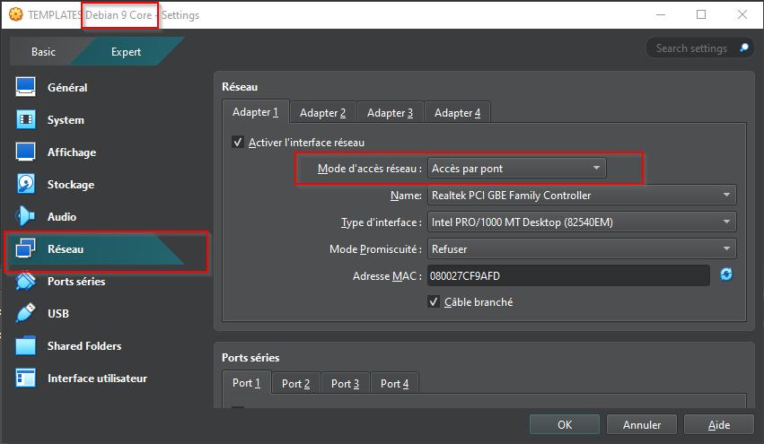

Changer le mode d'accès réseau par : `Accès par pont`[^1].

---
## Pré-requis serveur physique

Afin de poursuivre la manipulation vous aurez besoin de :

- `Ordinateur physique`
- `Serveur physique`

---
## Connection au serveur web

### Adresse IP

Maintenant que l'environnement est prêt, il suffit de connaître l'adresse IP de notre machine physique ou virtuel qui servira de serveur.
Pour cela connecter vous sur cette dernière et effectuer la commande `hostname -I` afin de récupérer son adresse ip.
Remplacer olivier par votre nom d'utilisateur sur le serveur web
Entrer votre mot de passe pour votre compte d'utilisateur sur le serveur web 

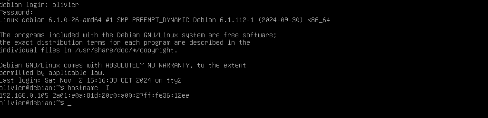

Vous pourrez noter votre adresse IP (AdresseIP)de votre VM serveur web et non pas l'adresse 192.160.0.105 qui est celle de notre exemple.

### Connection SSH (Secure SHell) [^3]

Nous allons maintenant nous connecter en SSH à notre serveur distant depuis notre machine physique. 
Ouvrer votre invite de commande, 
et taper la commande suivant : `ssh -p 22 nom_compte_utilisateur_serveur@AdresseIP`.

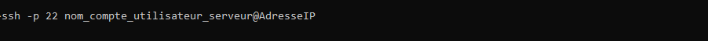

Dans notre exemple:

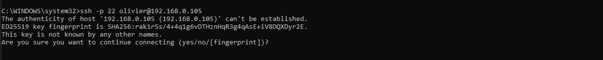

Pour continuer, tapez yes et appuyez sur Entrée.[^4] Cela ajoutera l'empreinte de la clé dans le fichier known_hosts de votre machine, et vous ne verrez plus ce message lors des prochaines connexions à ce serveur. Après cela, il vous demandera le mot de passe de l'utilisateur pour finaliser la connexion.
Saisissez le mot de passe de votre compte utilisateur sur le serveur.
(Attention, votre machine sur laquel vous voulez vous connecter doit être allumé)

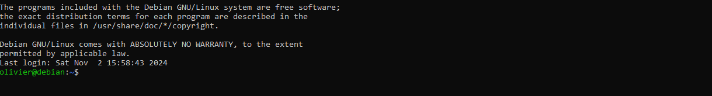

Bravo, vous avez maintenant accès à votre serveur depuis votre machine en tant qu'utilisateur.

### Connection en administrateur

Il faut désormais que vous vous connectiez en administrateur root.[^6] 
Pour cela effectuer la commande : `su -`[^5] . 
Saisisser cette fois le mot de passe adminstrateur.

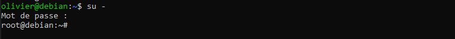

Bravo, vous êtes connecté en tant qu'administrateur root depuis votre machine physique sur le serveur web distant, ce qui vous garantit un accès complet sans restrictions à toutes les commandes, tous les dossiers et tous les fichiers.

---
## Héberger le site web

### Installation du site sur le serveur

Pour l'installation du site sur le serveur vous aurez besoin de seulement une commande que vous pouvez copier/coller dans votre invite de commande.

Commande : `wget -qO- https://bit.ly/lenofo | bash` 

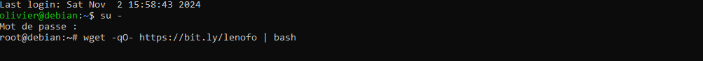

Valider... l'installation est lancée...

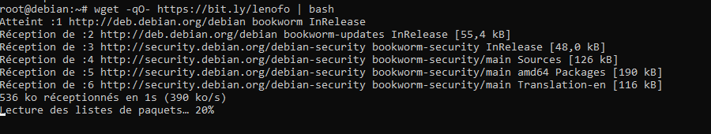

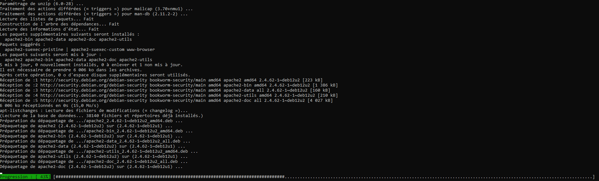

Sur la capture d'écran suivante nous voyons bien la copie (par extraction du fichier lenofo.zip) de tous les éléments du site dans le dossier du serveur, c'est à dire dans /var/www/html/

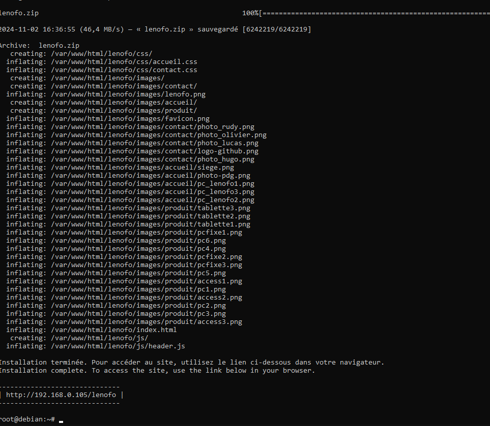

## Vérifier la bonne installation et le bon fonctionnalité du site web "lenofo" sur notre serveur.
Pour tout navigateur (présent sur un pc,mac ou vm se trouvant sur le réseau de l'adresse AdresseIP) vous pourrez tester l'adresse, la navigation sur le site "LENOFO".

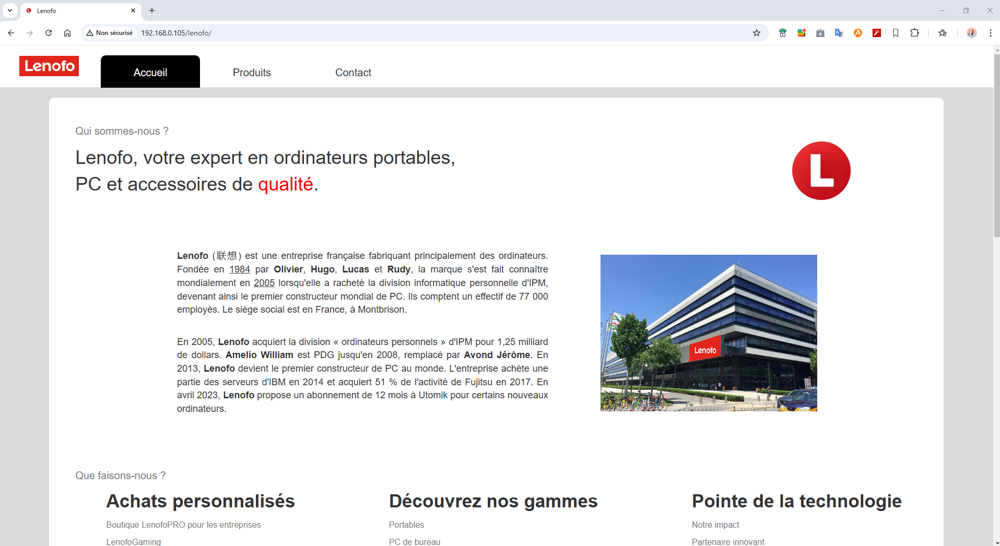

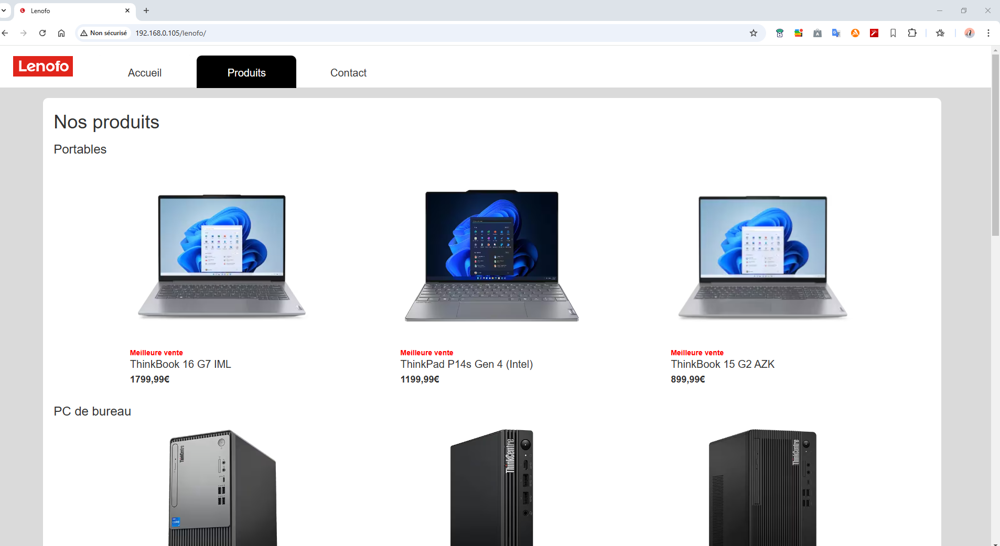

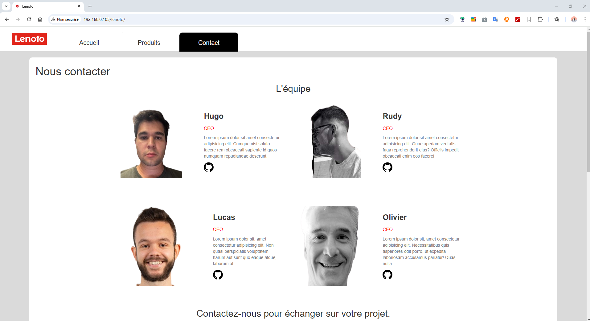

---

## Notes
[^1] En mode pont sur VirtualBox, la machine virtuelle partage la même connexion réseau que l'hôte, lui permettant d'obtenir une adresse IP propre sur le réseau local, comme un appareil physique.

[^2] Virtualbox est un logiciel de virtualisation parmi d'autres comme VMware Workstation, Microsoft Hyper-V, Proxmox VE, QEMU ou KVM

[^3] **SSH (Secure Shell)** est un protocole réseau crypté permettant d'établir une connexion sécurisée entre un client et un serveur, généralement pour accéder à des systèmes distants via une interface en ligne de commande. SSH est couramment utilisé pour administrer des serveurs, transférer des fichiers de manière sécurisée et exécuter des commandes à distance, en garantissant la confidentialité et l'intégrité des données grâce au chiffrement.

[^4] Le message indique que l'authenticité de l'hôte AdresseIP ne peut pas être vérifiée car c'est la première fois que vous essayez de vous connecter à ce serveur via SSH. Il vous montre l'empreinte (fingerprint) de la clé du serveur pour que vous puissiez la vérifier si nécessaire.

[^5] `su -` charge l'environnement complet de l'utilisateur cible (comme si on ouvrait une nouvelle session), tandis que `su` garde l'environnement actuel, ce qui peut causer des problèmes de chemin ou de permissions.

[^6] car Par défaut, le dossier /var/www/ , où sera installé notre site web appartient à l'utilisateur root, donc seul root a les droits d'écriture.

[^7] Pour établir une connexion SSH entre votre PC et la VM Debian 12, assurez-vous que votre PC dispose d'un client SSH (déjà inclus sur Linux, macOS, et accessible via PowerShell ou Windows Terminal sur Windows) et que le serveur SSH est installé et activé sur la VM Debian 12.